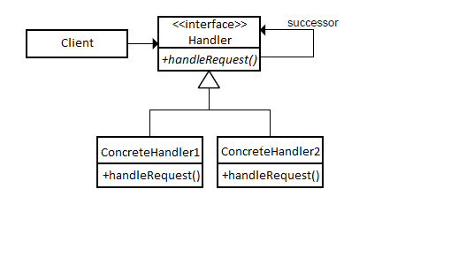

## Chain of Responsibility


### Същност
___

> * Предаване на заявка от клиента по верига от обекти, докато заявката не достигне обкет, който може да я изпълни.
> * Клиента знае за едно звено от веригата, към което прави заявката.
> * Звената са подредени в определен ред.
> * Опростява взаимодействието между звената.
>	* Всяко звено има референция към следваящото звено по веригата (инстанция на същия клас т.нар successor).


### Примери
___

 * В системите на банкоматите
 * Ръцете в покера
 * Йерархия в организация, където всяко ниво на йерархията има различна отговорност.

 
### Имплементация
___


###### Currency

```c#
public class Currency
    {
        private int amount;

        public Currency(int amount)
        {
            this.amount = amount;
        }

        public int GetAmount()
        {
            return this.amount;
        }
    }
```

###### Handler
```c#
public abstract class Dispenser
    {
        protected Dispenser Successor { get; set; }

        public void SetSuccessor(Dispenser successor)
        {
            this.Successor = successor;
        }

        public abstract void Dispense(Currency currency);
    }
```

###### Concrete Handler

```c#
public class Euro50Dispenser : Dispenser
    {
        private readonly int noteValue = 50;
        public override void Dispense(Currency currency)
        {
            int requestAmount = currency.GetAmount();

            if (requestAmount >= this.noteValue)
            {
                int amount = requestAmount / this.noteValue;
                int remainder = requestAmount % this.noteValue;

                Console.WriteLine($"Dispensing : { amount } x {this.noteValue} = {amount * this.noteValue} Euro");

                if (remainder != 0)
                {
                    this.Successor.Dispense(new Currency(remainder));
                }
            }
            else
            {
                this.Successor.Dispense(currency);
            }

        }
    }
```
###### Concrete Handler

```c#
ublic class Euro10Dispenser : Dispenser
    {
        private readonly int noteValue = 10;

        public override void Dispense(Currency currency)
        {
            int requestAmount = currency.GetAmount();

            if (requestAmount >= this.noteValue)
            {
                int amount = requestAmount / this.noteValue;
                int remainder = requestAmount % this.noteValue;

                Console.WriteLine($"Dispensing : { amount } x {this.noteValue} = {amount * this.noteValue} Euro");

                if (remainder != 0)
                {
                    Console.WriteLine($"ATM Error: Amount should be multiple of 10. Remainder from your request: {remainder} euros ( redirected to your account).");
                }
            }
            else
            {
                Console.WriteLine("ATM Error: Amount should be multiple of 10.");
            }
        }
    }
```


###### Usage

```c#
class Client
    {
        static void Main()
        {
            var amount = new Currency(333);
            var dispenser = new Euro50Dispenser();
            var dispenser20Euro = new Euro20Dispenser();
            var dispenser10Euro = new Euro10Dispenser();
            dispenser.SetSuccessor(dispenser20Euro);
            dispenser20Euro.SetSuccessor(dispenser10Euro);

            dispenser.Dispense(amount);
        }
    }
```
