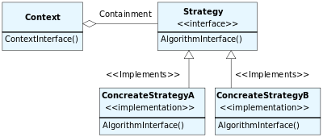

## Strategy

### Същност
___
>* Енкапсулира група свързани алгоритми.
>* Дава възможност алгоритъма да се развива и променя независимо от класа, който го използва.
>* Позволява класа да има една цел. (single responsibility principle)

### Необходимост от употреба
___
* Когато искаме да избегнем избор на алгоритъм чрез switch или поредица if конструкции.
* Когато добавянето на нова операция би коствало промени в класа.
 
### UML диаграма
___


### Имплементация
___

###### CalculateTravelCost (Context)

```c#
internal class CalculateTravelCost
    {
        private IVehicle vehicle;
        private decimal distance;

        public CalculateTravelCost(IVehicle vehicle, int distance)
        {
            this.vehicle = vehicle;
            this.distance = distance;
        }

        public void Display()
        {
            Console.WriteLine($"Traveling by { this.vehicle.GetType().Name }");
            Console.WriteLine($"Distance: { this.distance } km.");
            Console.WriteLine($"Travel costs: {this.Calculate() } euro.{ Environment.NewLine }");
        }

        private decimal Calculate()
        {
            return this.vehicle.GetCostPerKilometer() * this.distance;
        }
    }
```

###### IVehicle (Strategy)

```c#
interface IVehicle
    {
        decimal GetCostPerKilometer();
    }
```

###### Car (ConcreteStrategy)

```c#
  internal class Car : IVehicle
    {
        private decimal costPerKilometer;

        public Car()
        {
            this.costPerKilometer = 0.2m;
        }
        public decimal GetCostPerKilometer()
        {
            return this.costPerKilometer;
        }
    }
```
###### Bus (ConcreteStrategy)
```c#
internal class Bus : IVehicle
    {
        private int passengers;
        private decimal costPerKilometer;

        public Bus(int passengers)
        {
            this.passengers = passengers;
            this.costPerKilometer = 3.6m;
        }

        public decimal GetCostPerKilometer()
        {
            return this.costPerKilometer / this.passengers;
        }
    }
```

###### Usage
```c#
public  class Client
    {
        static void Main()
        {
            IVehicle car = new Car();
            IVehicle bus = new Bus(40);

            var costByCar = new CalculateTravelCost(car, 400);
            var costByBus = new CalculateTravelCost(bus, 400);

            costByCar.Display();
            costByBus.Display();
        }
    }
```
</br>
___
### Output

