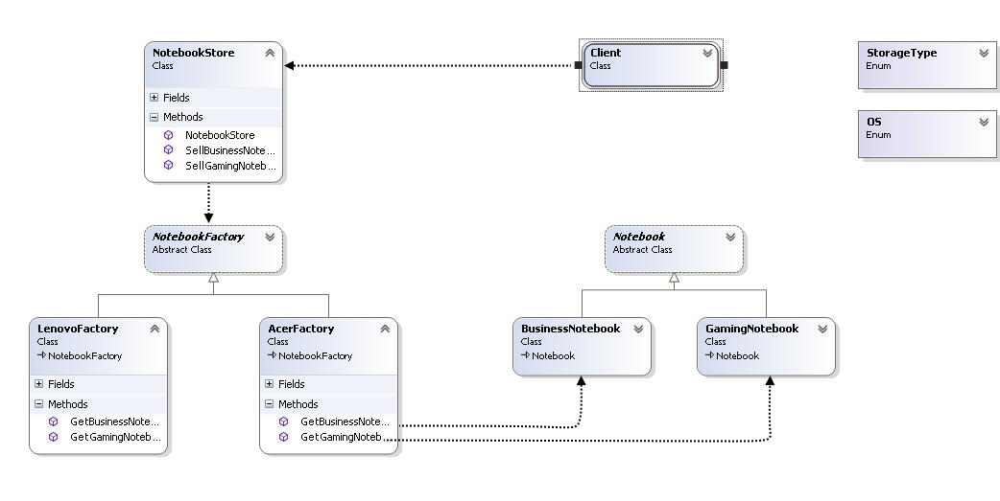

## Abstract Factory


### Необходимост от употреба
___

* При системи, които често се изменят и имат нужда от гъвкъв механизъм за замяна на конкретни групи от обекти.


### Цел
___
>*  Енкапсулация при създаването на сходни конкретни обекти, без конкретика върху техните класове.
>* Предоставяне на възможност на клиента да създава конкретна имплементация на абстрактна фабрика и да я използва през абстрактен интерфейс, за да създава конкретни обекти
>*  Разделяне на създаването на обект от използването му - конкретният обект се определя и създава от фабриката, но тя връща само абстрактен показател към него.

 
### Имплементация
___


###### Abstract Product ( Notebook )
```c#
public abstract class Notebook
    {
        public Notebook(double screenSize, string processor, int ram, StorageType storageType, OS operatingSystem, string videoCard, string manufacturer, string type)
        {
            this.ScreenSize = screenSize;
            this.Processor = processor;
            this.RAM = ram;
            this.StorageType = storageType;
            this.OperatingSystem = operatingSystem;
            this.VideoCard = videoCard;
            this.Manufacturer = manufacturer;
            this.Type = type;           
        }

        public double ScreenSize { get; set; }
        public string Processor { get; set; }
        public int RAM { get; set; }
        public StorageType StorageType { get; set; }
        public OS OperatingSystem { get; set; }
        public string VideoCard { get;set;}

        public string Manufacturer { get; set; }
        public string Type { get; set; }

        public override string ToString()
        {
            var description = new StringBuilder();

            description
                .AppendFormat("{0} {1} Notebook", this.Manufacturer, this.Type)
                .Append(Environment.NewLine + new string('-', 30) + Environment.NewLine)
                .AppendFormat("Screen size: {0}''", this.ScreenSize)
                .AppendLine()
                .AppendFormat("Processor: {0}", this.Processor)
                .AppendLine()
                .AppendFormat("RAM: {0} GB", this.RAM)
                .AppendLine()
                .AppendFormat("Storage type: {0}", this.StorageType)
                .AppendLine()
                .AppendFormat("Operating system: {0}", this.OperatingSystem)
                .AppendLine()
                .AppendFormat("Video card: {0}", this.VideoCard)
                .AppendLine();


            return description.ToString();
        }
    }
```
###### Concrete product #1  (Gaming Notebook)
```c#
 public class GamingNotebook : Notebook
    {
        public GamingNotebook(double screenSize, string processor, int ram, StorageType storageType, OS operatingSystem, string videoCard, string manufacturer)
            :base(screenSize, processor, ram, storageType, operatingSystem, videoCard, manufacturer,"Gaming")
        {
        }
    }
```
###### Concrete product #2 (Business Notebook)
```c#
 public class BusinessNotebook : Notebook
    {
        public BusinessNotebook(double screenSize, string processor, int ram, StorageType storageType, OS operatingSystem, string videoCard, string manufacturer)
            :base(screenSize, processor, ram, storageType, operatingSystem, videoCard, manufacturer,"Business")
        {
        }
    }
```
###### Abstract Factory
```c#
 public abstract class NotebookFactory
    {
        public abstract GamingNotebook GetGamingNotebook();

        public abstract BusinessNotebook GetBusinessNotebook();
    }
```
###### Concrete factory #1 (Lenovo Factory)
```c#
 public class LenovoFactory : NotebookFactory
    {
        private readonly string manufacturer = "Lenovo";
        public override GamingNotebook GetGamingNotebook()
        {
            return new GamingNotebook(15.6, "Intel i7 quad core", 16, StorageType.SSD, OS.Linux, "NVIDIA GTX-960M", this.manufacturer);
        }

        public override BusinessNotebook GetBusinessNotebook()
        {
            return new BusinessNotebook(15.6, "Intel i7", 8, StorageType.HDD, OS.Windows, "Intel HD Graphics 4200", this.manufacturer);
        }
    }
```

###### Concrete factory #2 (Acer Factory)
```c#
 public class AcerFactory : NotebookFactory
    {
        private readonly string manufacturer = "Acer";
        public override GamingNotebook GetGamingNotebook()
        {
            return new GamingNotebook(17.3, "Intel i7", 16, StorageType.SSD, OS.Windows, "NVIDIA GeForce GTX 960M", this.manufacturer);
        }

        public override BusinessNotebook GetBusinessNotebook()
        {
            return new BusinessNotebook(15.6, "intel i5", 4, StorageType.HDD, OS.Windows, "Intel HD Graphics 5500", this.manufacturer);
        }
    }
```
###### Notebook Store 
```c#
 public class NotebookStore
    {
        private readonly NotebookFactory factory;

        public NotebookStore(NotebookFactory factory)
        {
            this.factory = factory;
        }

        public GamingNotebook SellGamingNotebook()
        {
            return this.factory.GetGamingNotebook();
        }

        public BusinessNotebook SellBusinessNotebook()
        {
            return this.factory.GetBusinessNotebook();
        }
    }
```
###### Usage
```c#
static void Main(string[] args)
{
    var lenovoStore = new NotebookStore(new LenovoFactory());

    Console.WriteLine(lenovoStore.SellGamingNotebook());
    Console.WriteLine(new string('=',40));
    Console.WriteLine(lenovoStore.SellBusinessNotebook());
}
    
```

