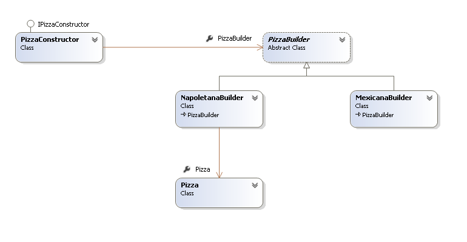

## Builder 


### Необходимост от употреба
___

Необходимост от употреба на патърна може да се срещне при наличието на един или повече от следните проблеми: 


 * Голям брой параметри, необходими при съсздаването на даден обект
 * Определена последователност от действия при създаване на обект т.е. постъпково създаване
 * Необходимост от различни разновидности на обекта  

### Цел
___
>Разделяне на логиката по конструиране на сложен обект от конктретни данни по създаването му, така че един и същ процес по създаване на обект да може да бъде използван за различни репрезентации на обекта.

### Допълнителни предимства
___
* Енкапсулация на начина на създаване на обекта
* Избягване на необходимостта от множество конструктори
* По-голяма гъвкавост на кода. Възможност за лесна имплементация на нови класове работещи с различни данни по създаването на обекта.
 
### Имплементация
___


###### Pizza
```c#
public class Pizza
    {
        private readonly string type;
        private readonly List<string> ingredients;

        public Pizza(string type)
        {
            this.type = type;
            this.ingredients = new List<string>();
        }

        public string Dough { get; set; }
        public string Topping { get; set; }
        public string Sauce { get; set; }

        public void AddIngredients(params string[] ingredients)
        {
            this.ingredients.AddRange(ingredients);
        }

        public override string ToString()
        {
            var description = new StringBuilder();
            description
            .AppendFormat("Pizza: {0}{1}", this.type, Environment.NewLine)
            .Append(new string('-', 20) + Environment.NewLine)
            .AppendFormat("Dough: {0}{1}", this.Dough, Environment.NewLine)
            .AppendFormat("Sauce: {0}{1}", this.Sauce, Environment.NewLine)
            .AppendFormat("Ingredients: {0}{1}", 
            string.Join(", ", this.ingredients), Environment.NewLine)
            .AppendFormat("Topping: {0}{1}", this.Topping, Environment.NewLine);

            return description.ToString();
        }
    }
```
###### Abstract Pizza Builder
```c#
public abstract class PizzaBuilder
    {
        public PizzaBuilder(string pizzaType)
        {
            this.Pizza = new Pizza(pizzaType);
        }

        public Pizza Pizza { get; protected set; }

        public abstract void SetDough();
        public abstract void SetSauce();
        public abstract void SetIngredients();
        public abstract void SetTopping();
    }
```
###### Pizza Napolitana Builder
```c#
 public class NapoletanaBuilder : PizzaBuilder
    {
        public NapoletanaBuilder()
            : base("Napolitana")
        {
        }

        public override void SetDough()
        {
            this.Pizza.Dough = "classic";
        }

        public override void SetSauce()
        {
            this.Pizza.Sauce = "salsa";
        }

        public override void SetIngredients()
        {
            this.Pizza.AddIngredients("tomatoes","olives", "capers");
        }

        public override void SetTopping()
        {
            this.Pizza.Topping = "mozzarella";
        }
    }
```
###### Pizza Mexicana Builder
```c#
public class MexicanaBuilder : PizzaBuilder
    {
        public MexicanaBuilder()
            : base("Mexicana")
        {
        }

        public override void SetDough()
        {
            this.Pizza.Dough = "slim";
        }

        public override void SetSauce()
        {
            this.Pizza.Sauce = "spicy";
        }

        public override void SetIngredients()
        {
            this.Pizza.AddIngredients("tomatoes","corn", "peppers","onion" );
        }
        public override void SetTopping()
        {
            this.Pizza.Topping = "yellow cheese";
        }
    }
```
###### Director Interface
```c#
 public interface IPizzaConstructor
    {
         void Construct(PizzaBuilder builder);       
    }
```

###### Director Implementation
```c#
public class PizzaConstructor : IPizzaConstructor
    {       
        public void Construct(PizzaBuilder builder)
        {
            builder.SetDough();
            builder.SetSauce();
            builder.SetIngredients();
            builder.SetTopping();
        }
    }
```

###### Usage
```c#
 static void Main(string[] args)
        {
            IPizzaConstructor constructor = new PizzaConstructor();

            PizzaBuilder builder = new NapoletanaBuilder();
            constructor.Construct(builder);
            Console.WriteLine(builder.Pizza);

            builder = new MexicanaBuilder();
            constructor.Construct(builder);
            Console.WriteLine(builder.Pizza);
        }
```

